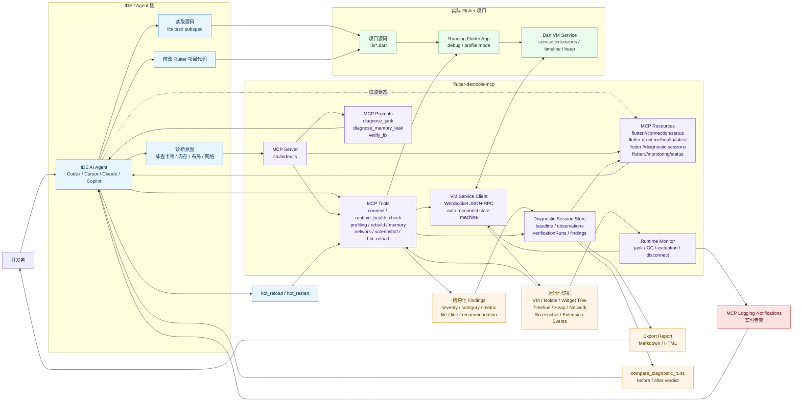

# MCP、Agent 与 Flutter 项目数据关系流转图

> 维护要求：当 MCP Tools、Resources、Diagnostic Session、Runtime Monitor、报告导出、连接状态机或 Agent 修复闭环发生结构性变化时，必须同步更新本文档中的流转图。

本文档描述 `flutter-devtools-mcp` 在 IDE AI Agent、MCP Server 和真实 Flutter 项目之间的数据关系与证据流转。

## 总览图



## 核心流转

```text
Agent 发起诊断意图
-> MCP Tool 调用 VM Service
-> 运行中的 Flutter App 返回运行时证据
-> MCP 生成文本报告 + 结构化 findings
-> 自动写入 diagnostic session
-> Agent 修改真实项目源码
-> hot_reload / hot_restart
-> 重跑同一诊断
-> compare_diagnostic_runs 判断修复是否有效
-> export_report 固化结果
```

## 关系说明

| 参与方 | 数据输入 | 数据输出 | 作用 |
|--------|----------|----------|------|
| IDE AI Agent | 用户意图、源码、MCP 工具结果、Resources、Notifications | 工具调用、代码修改、复测判断 | 编排诊断流程并执行修复 |
| flutter-devtools-mcp | Agent 工具调用、VM Service 数据流 | 文本报告、结构化 findings、session、report | 把运行时证据转换为 Agent 可用的调试语义 |
| Dart VM Service | 运行中的 Flutter App 状态 | Isolate、Timeline、Heap、Widget、Extension Events | 提供 Flutter 运行时事实来源 |
| Diagnostic Session | baseline、observation、verification findings | before/after verdict、可导出报告 | 保存一次问题排查的证据链 |
| Flutter 项目源码 | Agent 修改 | Hot Reload 后的新运行态 | 承载最终修复 |

## 同步更新清单

当出现以下变化时，需要同步更新本文档：

1. 新增或删除关键 MCP Tool。
2. 新增或删除 MCP Resource / Prompt。
3. Diagnostic Session 数据结构变化。
4. Runtime Monitor 监听类型变化。
5. VM Service 连接状态机或重连策略变化。
6. 新增自动写入 diagnostic session 的工具。
7. 修复闭环从 hot reload 扩展到其他验证方式。
8. 报告导出内容或格式发生结构性变化。
