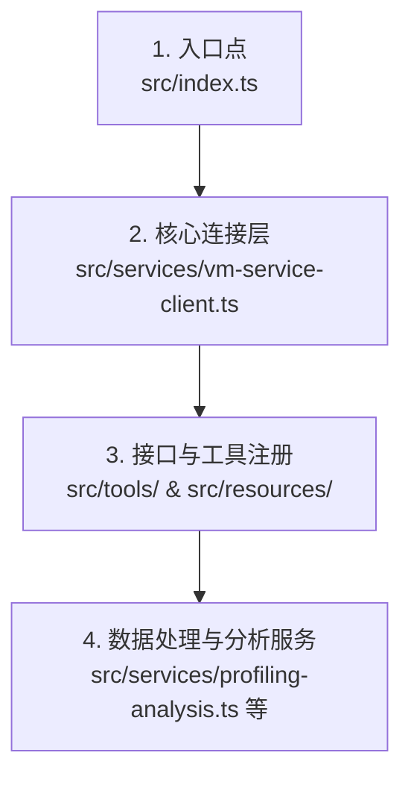

# 🚀 flutter-devtools-mcp 源码导读与交互式学习指南

> [!IMPORTANT]
> **维护要求**：当本项目有任何功能扩展、核心代码逻辑（如连接状态机、消息路由）或工具接口发生改动时，**必须同步更新本文档**。重点核对并更新：第二节的源码剖析、第三节的概念自测 Quiz 题以及第四、五节的实战调试步骤，以防教学内容失效或滞后。

欢迎！本指南专为新手设计，旨在帮助你从零开始**读懂、理解并掌握** `flutter-devtools-mcp` 项目的核心源码。

我们将采用“主线阅读法”，带你理清项目从启动到与 Flutter 应用程序连接、再到收集运行时证据并返回给 AI 智能体的完整代码脉络。

---

## 1. 🗺️ 源码探索主线路线图

不要面对成堆的 TypeScript 文件感到迷茫。建议新手按照以下主线顺序阅读项目源码：



1. **第一步：[package.json](file:///Users/yunlong/Desktop/github/flutter-devtools-mcp/package.json) 与 [src/index.ts](file:///Users/yunlong/Desktop/github/flutter-devtools-mcp/src/index.ts)**
   - 观察项目依赖了 `@modelcontextprotocol/sdk`（MCP 官方开发包）与 `ws`（WebSocket 库）。
   - 在 `index.ts` 中，看项目是如何初始化 `McpServer`、创建 `FlutterVmServiceClient`，并将各种工具模块（如 `registerConnectionTools`、`registerWidgetTreeTools`）挂载到服务器上的。
2. **第二步：[src/services/vm-service-client.ts](file:///Users/yunlong/Desktop/github/flutter-devtools-mcp/src/services/vm-service-client.ts)**
   - 这是整个项目的**心脏**。阅读它如何通过 WebSocket 与运行中的 Flutter/Dart VM 实例建连、如何处理收发的 JSON-RPC 数据包，以及如何处理网络断开与重连。
3. **第三步：`src/tools/` 目录**
   - 看看各模块（如 [connection.ts](file:///Users/yunlong/Desktop/github/flutter-devtools-mcp/src/tools/connection.ts)、[widget-tree.ts](file:///Users/yunlong/Desktop/github/flutter-devtools-mcp/src/tools/widget-tree.ts)）是如何调用 `FlutterVmServiceClient` 并将数据包装成标准的 MCP 输出的。
4. **第四步：`src/services/` 下的数据分析模块**
   - 阅读 [profiling-analysis.ts](file:///Users/yunlong/Desktop/github/flutter-devtools-mcp/src/services/profiling-analysis.ts)、[network-analysis.ts](file:///Users/yunlong/Desktop/github/flutter-devtools-mcp/src/services/network-analysis.ts) 等。这些模块包含了核心的“证据分析”算法（如卡顿检测、性能评级、内存 Diff 等）。

---

## 2. 🔌 核心通信层源码深度剖析

我们来重点攻关 [vm-service-client.ts](file:///Users/yunlong/Desktop/github/flutter-devtools-mcp/src/services/vm-service-client.ts)，它是新手最需要读懂的文件。

### 2.1 WebSocket 双工通道的“同步化”封装

**痛点**：WebSocket 属于典型的异步双工通道。发送请求和接收响应是相互独立的事件，这导致编写业务逻辑时很容易陷入繁琐的回调地狱。
**解法**：项目使用了一个巧妙的 `pendingRequests` Map 容器，将异步消息匹配转化为 `Promise` 的挂起与恢复：

```typescript
// 1. 定义存储 Promise 句柄的容器
private requestId = 0;
private pendingRequests = new Map<
  string,
  {
    resolve: (value: unknown) => void;
    reject: (reason: unknown) => void;
    timer: NodeJS.Timeout;
  }
>();

// 2. 发送请求：返回一个挂起的 Promise
async callMethod(method: string, params?: Record<string, unknown>): Promise<unknown> {
  const id = String(++this.requestId); // 生成唯一请求 ID
  const request = { jsonrpc: "2.0", id, method, params };

  return new Promise((resolve, reject) => {
    // 设置 30s 超时保护
    const timer = setTimeout(() => {
      this.pendingRequests.delete(id);
      reject(new Error(`Request timeout: ${method}`));
    }, 30000);

    // 将本请求的 resolve, reject 句柄以 id 为 Key 存入 Map
    this.pendingRequests.set(id, { resolve, reject, timer });
    this.ws!.send(JSON.stringify(request)); // 通过 WebSocket 发送 JSON
  });
}
```

在 `socket.on("message")` 触发的方法 `handleMessage` 中进行匹配唤醒：

```typescript
private handleMessage(data: string): void {
  const message = JSON.parse(data);
  
  if ("id" in message && message.id) {
    // 根据返回报文的 id，从 Map 中查找挂起的 Promise 句柄
    const pending = this.pendingRequests.get(message.id);
    if (pending) {
      clearTimeout(pending.timer);       // 清除超时定时器
      this.pendingRequests.delete(message.id); // 从 Map 中移除
      
      // 唤醒 Promise，将其结果或错误返回给最初 await 的调用者！
      if (message.error) {
        pending.reject(new Error(message.error.message));
      } else {
        pending.resolve(message.result);
      }
    }
  }
  // ... 其他流式事件通知通知处理
}
```

> [!NOTE]
> **阅读启发**：这套机制让上层工具可以用 `const vm = await client.getVM();` 这样优雅的同步风格代码调用，极大地降低了开发复杂度。

---

### 2.2 寻找主 Isolate（Flutter UI 线程）

当连上 Dart VM 后，你会发现虚拟机里运行着多个 Isolates（ Dart 里的并发隔离区，类似于线程）。
为什么我们在连接成功后，一定要执行下面这行代码？

```typescript
// 查找非系统 Isolate，通常第一个即为 Flutter 的主 Isolate
const flutterIsolate = vmInfo.isolates.find((i) => !i.isSystemIsolate);
if (flutterIsolate) {
  this._mainIsolateId = flutterIsolate.id;
}
```

**原因**：
- 系统 Isolate（如 `_helperIsolate`）用于垃圾回收或 VM 内部辅助任务。
- Flutter 应用程序所有的渲染、UI 布局、业务逻辑以及 Flutter 注册的各种服务扩展方法（Service Extensions），都只绑定在**主 Isolate** 上。
- 如果我们在发送 Service Extension（如获取 Widget 树）时传入了系统 Isolate 的 ID，或者不传 ID，虚拟机就会抛出“未找到方法”的错误。因此，**捕获主 Isolate ID 是进行任何 Flutter 特有调试的先决条件**。

---

### 2.3 健壮性设计：指数退避重连状态机

当你在调试 Flutter 应用时，经常会发生“热重启（Hot Restart）”或频繁插拔数据线导致连接断开。为了让 AI Agent 诊断时不掉线，项目实现了指数退避（Exponential Backoff）重连状态机：

```typescript
private scheduleReconnect(): void {
  if (this.reconnectAttempts >= this.maxReconnectAttempts) {
    this.setConnectionState("disconnected");
    this.emit("reconnect_failed", ...);
    return;
  }

  this.reconnectAttempts++;
  // 计算退避延迟时间：1s -> 2s -> 4s -> 8s... 避免在应用重建期间频繁轰炸虚拟机
  const delayMs = this.reconnectBaseDelayMs * Math.pow(2, Math.max(0, this.reconnectAttempts - 1));
  this.setConnectionState("reconnecting");
  
  this.reconnectTimer = setTimeout(() => {
    this.openConnection(this._vmServiceUri!, true).catch(() => {});
  }, delayMs);
}
```

---

## 3. 📊 数据分析与业务逻辑层解密

除了底层的连接外，本项目的一大亮点是它内置了对原始性能/内存指标的“深度提炼”算法，让 AI Agent 可以直接得到带有评级（🟢/🟡/🟠/🔴）和建议的诊断报告。

### 3.1 性能卡顿（Jank）检测算法

卡顿是如何被判断出来的？我们来看 [src/services/profiling-analysis.ts](file:///Users/yunlong/Desktop/github/flutter-devtools-mcp/src/services/profiling-analysis.ts)：

```typescript
// 1. 获取设备显示刷新率，计算单帧最大允许时间目标值（如 60 FPS 对应 16.67ms）
const frameTargetMs = 1000 / refreshRate; // 60fps -> 16.67ms, 120fps -> 8.33ms

// 2. 遍历 timeline 数据，寻找与 Frame 相关的 Timeline 事件
// Flutter 引擎会输出 "PipelineProduce` 或 "VSYNC" 等事件，包含其开始 ts 和持续耗时 dur。
const jankyFrames = frames.filter(f => f.durationMs > frameTargetMs);
const jankPercentage = (jankyFrames.length / frames.length) * 100;
```

如果某帧总耗时超过了 `frameTargetMs`，它就会被标记为 **Jank Frame（卡顿帧）**。分析器还会解析这帧里的 `Build`、`Layout` 和 `Paint` 各阶段的耗时比例，如果 `Build` 耗时过高，会在报告中给出建议：“请检查是否发生了多余的 Widget 重建（Rebuild）”。

---

### 3.2 内存快照差分比对算法

在 [src/services/diagnostic-comparison.ts](file:///Users/yunlong/Desktop/github/flutter-devtools-mcp/src/services/diagnostic-comparison.ts) 中，看项目是如何判定是否存在内存泄漏的：

1. **GC 预处理**：获取快照前，先向 VM 发送命令触发垃圾回收（`gc: true`），确保快照中存活的对象都是真正无法被回收的。
2. **生成类哈希映射**：将前后两次的类列表转化为以 `className` 为 Key，`instances` 和 `bytes` 为 Value 的 Map。
3. **计算 Delta 差值**：
   ```typescript
   const deltaBytes = currentStats.bytesCurrent - baselineStats.bytesCurrent;
   const deltaInstances = currentStats.instancesCurrent - baselineStats.instancesCurrent;
   ```
4. **自动评判（Verdict）**：如果对比发现与 UI 相关的对象（如 `Element`、`RenderObject`、`StreamSubscription`）在返回基准页面后数量不降反升，分析器就会向 Agent 报警，并准确定位是哪一个类增长最快，指引 Agent 去排查未释放的监听器或内存残留。

---

## 4. ✏️ 源码理解度自测 Quiz

现在，你已经读过了核心代码。来通过以下 5 道题自测一下你对代码细节的理解吧！

### Q1: `console.log` 的禁令
为什么在编写本项目的 MCP 工具时，绝对不能在代码中随意调用原生的 `console.log("...")` 打印普通调试信息？
<details>
<summary>💡 点击查看答案与解析</summary>

**正确答案：因为会破坏 MCP 服务器的 stdio 传输通道。**

**解析**：在 `index.ts` 中，MCP Server 是通过标准输入输出（Stdio）进行通信的：
`await server.connect(new StdioServerTransport())`。
如果我们在工具中执行了 `console.log()`，它的输出会被作为 MCP 协议响应发送给 IDE 客户端。因为我们输出的不是合法的 JSON-RPC 格式，IDE 客户端的 JSON 解析器会直接崩溃，从而导致 AI Agent 与调试工具彻底断连。
**正确做法**：如果需要打印调试日志，必须使用 `console.error()` 或者通过调用 `server.sendLoggingMessage` 来发送结构化日志。
</details>

---

### Q2: Isolate 未就绪错误排查
假设在调用 `getWidgetTree` 时，虚拟机抛出了 `Method not found` 或 `Invalid Isolate` 错误。这在代码逻辑上最可能是什么原因造成的？
<details>
<summary>💡 点击查看答案与解析</summary>

**正确答案：`client.mainIsolateId` 此时为 null，或者未指向非系统 Isolate。**

**解析**：当 Flutter 刚刚启动或发生热重启时，原有的 Isolate 会被销毁，并创建新的 Isolate。如果我们在新 Isolate 还没有向客户端广播 `isolateRunnable` 事件、或者客户端还没来得及更新 `_mainIsolateId` 时就发送了 Flutter 的 Service Extension 请求，就会因为 Isolate ID 失效而报错。
</details>

---

### Q3: 内存快照前强制 GC 的作用
在 [src/tools/memory.ts](file:///Users/yunlong/Desktop/github/flutter-devtools-mcp/src/tools/memory.ts) 中，获取内存分配情况时有一个可选参数 `gc?: boolean`。在做内存泄漏排查时，为什么将它设为 `true` 极为关键？
<details>
<summary>💡 点击查看答案与解析</summary>

**正确答案：为了过滤掉那些“已经是垃圾但尚未被回收”的临时对象，确保比对数据的准确性。**

**解析**：如果不进行强制 GC，许多已经失去引用的垃圾对象依然会残留在堆中。在进行快照对比（Snapshot Diff）时，这些待回收的脏数据会严重干扰判断，导致原本已经没有内存泄漏的代码被误判为发生了泄漏。
</details>

---

### Q4: 实时监控（Runtime Monitor）事件流订阅
在 [src/services/runtime-monitor.ts](file:///Users/yunlong/Desktop/github/flutter-devtools-mcp/src/services/runtime-monitor.ts) 中，它是通过什么方法实时捕获到 Flutter 应用中发生的长 GC、异常或卡顿事件的？
<details>
<summary>💡 点击查看答案与解析</summary>

**正确答案：通过向 VM 发送 `streamListen` 注册对 `GC`、`Extension` 和 `Logging` 事件流的监听。**

**解析**：在连接建立时，客户端会订阅这些系统内置的流。当虚拟机产生垃圾回收、日志输出或 Flutter 引擎抛出 Jank 帧事件时，会通过 WebSocket 推送 Notification。`RuntimeMonitor` 绑定了这些 `stream:*` 事件，从而能在第一时间内捕获到性能抖动并回传给 MCP Logging 通道。
</details>

---

### Q5: 为什么 `ext.flutter.reassemble` 可以恢复修改后的界面？
当我们通过代码工具链执行 `hotReload` 时，它除了要求虚拟机载入最新的源码外，为什么还必须要触发 `ext.flutter.reassemble` 这一扩展服务？
<details>
<summary>💡 点击查看答案与解析</summary>

**正确答案：为了强制 Flutter 框架清空全部渲染缓存，从根节点触发整个 Widget 树的重建。**

**解析**：仅仅把编译好的 Dart 字节码注入虚拟机只能更新类和函数定义，但运行中已经存在的 Widget 状态（Element Tree）并不会自动发生变化。调用 `reassemble` 能够使整个应用执行一次自我重构与绘制，把代码中的修改瞬间映射到当前屏幕的 UI 上。
</details>

---

## 5. 🛠️ 实战练习：在代码中添加一个新的监控警报

为了帮助你巩固对源码的理解，我们将动手修改 `RuntimeMonitor` 代码，添加一个**对慢网络请求（Slow HTTP Requests）的实时监控告警**！

### 练习任务说明
当应用发起网络请求且耗时超过 2 秒时，`RuntimeMonitor` 应该自动产生一条警告消息，并通过 MCP 的日志通道实时发送给 AI Agent 客户端。

### 第一步：定位代码文件
打开 [src/services/runtime-monitor.ts](file:///Users/yunlong/Desktop/github/flutter-devtools-mcp/src/services/runtime-monitor.ts)。
寻找它的初始化以及对事件的订阅部分。

### 第二步：分析现有逻辑
你会发现在构造函数中，它通过 `client.on("stream:Extension", ...)` 监听了来自 Flutter 的扩展流事件：

```typescript
// 现有的事件处理代码片断：
this.client.on("stream:Extension", (event) => {
  const extensionKind = event.extensionKind;
  // 观察现有的 jank 或 GC 事件处理...
});
```

### 第三步：添加网络请求事件监测
在 `stream:Extension` 监听器内部，我们可以通过匹配 `event.extensionKind` 为 `Firehose` 或者特殊的 `HttpProfile` 事件来分析网络。在 Flutter 中，网络事件常作为 Timeline 或特定的 Service Extension 事件抛出。
为了演示，我们假设我们要拦截 `HttpProfileRequest` 类型的事件。你可以添加以下处理逻辑：

```typescript
// 在 stream:Extension 监听器内追加以下分支：
if (event.extensionKind === 'Flutter.HttpClientRequest') {
  const requestData = event.extensionData;
  const durationMs = requestData.durationMs;
  
  if (durationMs > 2000) { // 超过 2 秒
    const alert: MonitorAlert = {
      id: `network_${Date.now()}`,
      timestamp: Date.now(),
      type: "network",
      severity: "high",
      message: `Slow HTTP Request detected: ${requestData.method} ${requestData.uri} took ${durationMs}ms`,
      details: requestData
    };
    
    // 调用回调函数，它会自动将日志发送到 MCP Logging 通道
    this.alertCallback(alert);
  }
}
```

### 第四步：构建并运行
修改代码后，在项目根目录下执行编译：
```bash
npm run build
```
这样你的实时网络请求慢告警就已经生效了！下次当你在真机/模拟器上刷新慢网页时，你的 AI 客户端（如 Cursor 控制台）就会自动弹出一行醒目的警告。

---

## 🌟 结语

恭喜你！现在你不仅理解了 MCP 与 Dart VM 的概念，更摸透了本项目的底层通信原理、卡顿与内存判定算法以及事件流转发机制。

如果你想要继续深入，建议多利用 [MCP Inspector](https://modelcontextprotocol.io/docs/tools/inspector) 亲自发送几条原始的 JSON-RPC 报文。当你能在控制台熟练操纵虚拟机时，你就已经真正掌握了本项目的精髓！
