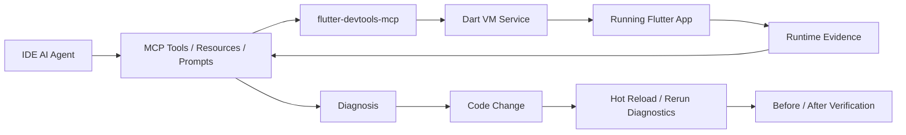
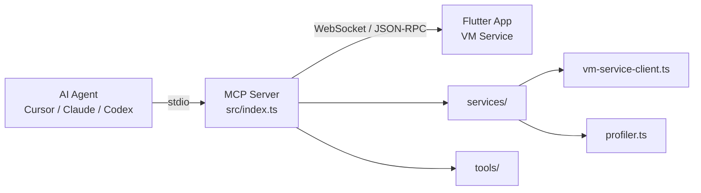

# Flutter DevTools MCP — 项目规划方案

> **目标读者**：Codex / AI Agent 开发者  
> **分析基准**：v0.2.0 + `runtime_health_check`  
> **生成时间**：2026-05-16  
> **平台范围**：macOS / Linux（不含 Windows）  

---

## 一、项目目标

本项目的核心目标是把 IDE 里的 AI Agent 从“只会读代码”升级为“能观察运行中的 Flutter 应用、提出诊断、修改代码、验证修复结果”的调试代理。

目标形态不是复刻 Flutter DevTools UI，而是把 Dart VM Service、Flutter Inspector、Timeline、Heap、Network、Screenshot 等运行时能力包装成适合 AI Agent 使用的 MCP 能力。



### 核心闭环

1. **连接运行态**：发现并连接本地 Flutter App。
2. **建立基线**：通过 `runtime_health_check` 判断当前 App、Isolate、扩展能力、Widget 和内存状态。
3. **专项诊断**：按问题类型采集 Widget、Rebuild、Profiling、Memory、Network、Screenshot。
4. **源码定位**：把运行时结果映射到本地源码文件和行号。
5. **实施修复**：AI Agent 修改代码。
6. **热重载与复测**：调用 Hot Reload 后重复相同诊断。
7. **验证结果**：比较前后指标，判断修复是否有效。

---

## 二、当前架构与能力



| 层级 | 文件 | 职责 |
|------|------|------|
| 入口 | `src/index.ts` | 初始化 MCP Server，注册所有工具模块 |
| 核心通信 | `src/services/vm-service-client.ts` | 维护 WebSocket + JSON-RPC 2.0 连接，封装 VM Service 调用 |
| 分析引擎 | `src/services/profiler.ts` | 解析 Timeline，生成帧率、阶段耗时、CPU 热点分析 |
| 工具层 | `src/tools/*.ts` | 面向 AI Agent 暴露 MCP Tools |

### 当前工具清单（31 个）

| 类别 | 工具名 | 状态 |
|------|--------|------|
| 发现/连接 | `discover_apps`, `connect`, `disconnect`, `get_app_info`, `runtime_health_check` | 已具备 |
| Widget | `get_widget_tree`, `inspect_widget` | 已具备 |
| 重建追踪 | `start_tracking_rebuilds`, `stop_tracking_rebuilds` | 已具备 |
| 性能 | `start_profiling`, `stop_profiling` | 已具备 |
| 内存 | `get_memory_snapshot`, `save_snapshot`, `compare_snapshots`, `list_snapshots` | 已具备 |
| 网络 | `start_network_capture`, `stop_network_capture` | 已具备 |
| 持续监控 | `start_monitoring`, `get_monitoring_status`, `stop_monitoring` | 已具备 |
| 调试动作 | `hot_reload`, `hot_restart`, `take_screenshot`, `compare_screenshots`, `toggle_debug_paint`, `evaluate_expression` | 已具备 |
| 诊断会话 | `start_diagnostic_session`, `record_diagnostic_observation`, `compare_diagnostic_runs`, `list_diagnostic_sessions`, `end_diagnostic_session` | 已具备 |

### 当前 MCP Resources / Prompts

| 类型 | 名称 | 状态 |
|------|------|------|
| Resource | `flutter://connection/status` | 已具备 |
| Resource | `flutter://runtime/health/latest` | 已具备 |
| Resource | `flutter://snapshots` | 已具备 |
| Resource | `flutter://profiling/status` | 已具备 |
| Resource | `flutter://monitoring/status` | 已具备 |
| Resource | `flutter://diagnostic-sessions` | 已具备 |
| Prompt | `diagnose_jank` | 已具备 |
| Prompt | `diagnose_memory_leak` | 已具备 |
| Prompt | `diagnose_layout_issue` | 已具备 |
| Prompt | `diagnose_network_issue` | 已具备 |
| Prompt | `verify_fix` | 已具备 |

### 已完成的关键进展

`runtime_health_check` 已作为连接后的第一诊断入口加入工具集。它把 VM 状态、主 Isolate、Flutter service extensions、浅层 Widget 基线、深度模式内存基线和下一步建议整合成 Agent 可读的运行时概览。

---

## 三、落地原则

### 3.1 优先做能形成闭环的能力

单个工具输出再丰富，也只是“观察”。项目优先级应围绕闭环排序：

```text
观察运行态 -> 定位源码 -> 修改代码 -> Hot Reload -> 复测 -> 比较结果
```

能帮助闭环的能力优先，例如诊断会话、结构化输出、源码定位、前后对比。纯展示型能力延后。

### 3.2 工具输出必须同时服务人和 Agent

每个核心工具最终应提供两层输出：

| 输出类型 | 面向对象 | 要求 |
|----------|----------|------|
| 文本报告 | 开发者 | 易读、能解释问题和下一步 |
| 结构化 JSON | AI Agent | 稳定字段、包含 severity、file、line、metric、nextAction |

短期可以继续保留文本报告，但新增能力要优先设计结构化数据边界。

### 3.3 运行时证据优先于静态猜测

Agent 修改代码前应尽量先拿到运行时证据：

- 页面结构问题：先看 Widget Tree / Screenshot。
- 卡顿问题：先看 Timeline / Rebuild Tracker。
- 内存问题：先做 Snapshot Diff。
- 网络问题：先抓请求耗时、状态码、大小。

没有证据时，Agent 应明确标注为“静态推断”，不能当作已验证结论。

### 3.4 不破坏现有 Tool API

所有现有工具的 `name` 和必填参数保持兼容。新增能力优先通过：

- 新增工具。
- 新增可选参数。
- 增加结构化输出字段。
- 增加 MCP Resources / Prompts。

### 3.5 质量门禁先于复杂功能

当前项目缺少测试、lint、公共类型抽取。继续扩展前，需要先把共享格式化函数、共享类型和核心分析逻辑测试补上。否则后续 Resources、Prompts、报告导出会不断复制已有技术债。

---

## 四、问题与技术债务

### 4.1 工程质量

| # | 问题 | 位置 | 严重度 | 处理策略 |
|---|------|------|--------|----------|
| E1 | 无单元/集成测试 | 全局 | 高 | 先测纯函数和 profiler 分析逻辑 |
| E2 | 无 ESLint/Prettier | 全局 | 中 | 加脚本和配置，避免大范围格式化噪音 |
| E3 | `formatBytes` 重复定义 | memory, snapshot-diff, runtime-health | 中 | 抽到 `src/utils/format.ts` |
| E4 | `WidgetNode` 等类型重复 | widget-tree, runtime-health | 中 | 抽到 `src/types/` |
| E5 | 工具状态存在模块闭包中 | tools/*.ts | 中 | 后续用诊断会话统一管理 |

### 4.2 健壮性

| # | 问题 | 位置 | 严重度 | 处理策略 |
|---|------|------|--------|----------|
| R1 | WebSocket 断开后无自动重连 | vm-service-client.ts | 高 | 增加连接状态机和可观测事件 |
| R2 | App 发现对 macOS/Linux 临时目录兼容不足 | discover.ts | 中 | 使用 `os.tmpdir()` 和受控并发 |
| R3 | Network 捕获依赖 `dart:io` | network.ts | 中 | 明确能力边界，补充 Timeline 解析和提示 |
| R4 | Profiler Begin/End 配对按 index 匹配 | profiler.ts | 中 | 改为 `tid` + 栈式配对 |

### 4.3 Agent 闭环能力缺口

| # | 缺口 | 影响 | 处理策略 |
|---|------|------|----------|
| A1 | 无诊断会话模型 | 工具结果孤立，难以前后对比 | 增加 session/baseline/run 结构 |
| A2 | 无 MCP Resources | Agent 无法主动读取连接状态和快照列表 | 暴露 connection/snapshots/profiling resources |
| A3 | 无 MCP Prompts | 每次排查都靠 Agent 临场编排 | 内置卡顿、内存、布局、网络流程模板 |
| A4 | 缺少结构化输出 | Agent 难以稳定定位源码和排序问题 | 引入统一 report schema |
| A5 | 截图不落盘 | 难以前后视觉对比 | 支持保存截图和 compare_screenshots |

---

## 五、阶段规划

### Phase 0：当前基线

**状态**：已完成。

**交付物**：

- `runtime_health_check` 工具。
- README 使用流程更新。
- 最佳实践文档中加入运行时基线和复测流程。

**Agent 能力变化**：连接 App 后不再盲目选择工具，而是可以先建立运行时基线。

---

### Phase 1：工程基建与共享模型

**目标**：降低后续迭代成本，避免重复逻辑继续扩散。

#### Task 1.1 — 公共工具模块抽取

- **状态**：已完成。
- **目标**：消除 `formatBytes`、`formatDuration`、`pctChange` 和共享类型重复。
- **涉及文件**：
  - 新建 `src/utils/format.ts`
  - 新建 `src/types/widget.ts`
  - 新建 `src/types/runtime.ts`
  - 修改 `memory.ts`, `snapshot-diff.ts`, `network.ts`, `widget-tree.ts`, `runtime-health.ts`
- **验收**：
  - 已通过 `npm run build`。
  - `rg "function formatBytes" src` 仅在 `src/utils/format.ts` 命中。
  - `WidgetNode`、`FlatWidget`、`IsolateInfo` 已收敛到 `src/types/`。

#### Task 1.2 — 测试框架与核心单测

- **状态**：已完成。
- **目标**：为后续分析算法重构建立安全网。
- **涉及文件**：
  - 新建 `vitest.config.ts`
  - 新建 `tests/`
  - 修改 `package.json`
- **实现要点**：
  - 使用 `vitest`。
  - 优先测试 `format.ts`、Widget 统计逻辑、Profiler 纯分析逻辑。
  - 为后续 `compare_diagnostic_runs` 预留测试样例。
- **验收**：
  - 已通过 `npm test`。
  - 已通过 `npm run build`。
  - 已覆盖 `format.ts`、Widget 统计逻辑、Profiler Timeline 纯分析逻辑。

#### Task 1.3 — Lint / Format 质量门禁

- **状态**：已完成。
- **目标**：减少后续多人/多 Agent 协作产生的风格漂移。
- **实现要点**：
  - 增加 ESLint + Prettier。
  - 先以“不产生大规模无关格式化 diff”为原则。
  - `no-explicit-any` 可以分阶段收紧，先禁止新增明显 `any`。
- **验收**：
  - 已通过 `npm run lint`。
  - 已通过 `npm run format:check`。
  - 已通过 `npm test`。
  - 已通过 `npm run build`。
  - 不引入运行时依赖。

---

### Phase 2：诊断会话与结构化输出

**目标**：让 Agent 能把多次工具调用串成一次可比较的诊断过程。

#### Task 2.1 — Diagnostic Session 模型

- **状态**：已完成。
- **目标**：保存一次诊断中的基线、专项采集结果和复测结果。
- **新增工具建议**：
  - `start_diagnostic_session`
  - `record_diagnostic_observation`
  - `end_diagnostic_session`
  - `list_diagnostic_sessions`
- **核心字段**：
  - `sessionId`
  - `problemType`
  - `startedAt`
  - `baseline`
  - `observations`
  - `codeChanges`
  - `verificationRuns`
- **验收**：
  - Agent 可以创建 session，并把 runtime health、profiling、rebuild、memory 结果归档到同一 session。
  - 已新增 `start_diagnostic_session`、`record_diagnostic_observation`、`list_diagnostic_sessions`、`end_diagnostic_session`。

#### Task 2.2 — 统一结构化报告 Schema

- **状态**：已完成。
- **目标**：让工具结果可以被 Agent 稳定解析和排序。
- **建议字段**：

```ts
interface DiagnosticFinding {
  id: string;
  severity: "info" | "low" | "medium" | "high" | "critical";
  category: "widget" | "rebuild" | "performance" | "memory" | "network" | "runtime";
  title: string;
  evidence: string;
  metric?: {
    name: string;
    value: number;
    unit: string;
    threshold?: number;
  };
  location?: {
    file?: string;
    line?: number;
    column?: number;
    symbol?: string;
  };
  recommendation?: string;
  nextTool?: string;
}
```

- **验收**：
  - `runtime_health_check`、`stop_profiling`、`stop_tracking_rebuilds` 已输出同源结构化 finding。
  - 文本报告保持兼容。

#### Task 2.3 — 前后对比能力

- **状态**：已完成。
- **目标**：验证修复是否有效，而不是只判断代码是否“看起来合理”。
- **新增工具**：
  - `compare_diagnostic_runs`
- **比较维度**：
  - 已支持：结构化 finding 中的 Jank rate、build phase、CPU hotspot、Top rebuild count、heap utilization 等数值 metric。
  - 后续扩展：P90/P99 frame time、Heap delta、Network latency / size、Screenshot before/after。
- **验收**：
  - 对同一 session 中的 before/after observation 输出 verdict：`improved`、`regressed`、`unchanged`、`inconclusive`。
  - 默认比较 baseline 与最新 verification，也支持显式指定 before/after observation ID。

---

### Phase 3：MCP 原生能力增强

**目标**：让 Agent 不只通过 Tools 被动调用，还能通过 Resources 和 Prompts 主动读取状态与使用标准流程。

#### Task 3.1 — MCP Resources

- **状态**：已完成。
- **目标**：暴露当前状态，减少重复 Tool 调用。
- **Resources**：
  - `flutter://connection/status`
  - `flutter://runtime/health/latest`
  - `flutter://snapshots`
  - `flutter://profiling/status`
  - `flutter://monitoring/status`
  - `flutter://diagnostic-sessions`
- **验收**：
  - MCP Inspector 可列出并读取这些 Resources。
  - `runtime_health_check` 成功执行后会刷新 `flutter://runtime/health/latest`。
  - `save_snapshot` 写入的快照会同步反映在 `flutter://snapshots`。

#### Task 3.2 — MCP Prompts

- **状态**：已完成。
- **目标**：把专家排查流程固化为 Agent 可调用模板。
- **Prompts**：
  - `diagnose_jank`
  - `diagnose_memory_leak`
  - `diagnose_layout_issue`
  - `diagnose_network_issue`
  - `verify_fix`
- **验收**：
  - Agent 调用 Prompt 后能得到明确的工具调用顺序、用户交互提示和复测要求。

#### Task 3.3 — Notifications

- **状态**：已完成。
- **目标**：让 Agent 能感知异步运行时事件。
- **事件来源**：
  - 已支持 VM Service 断连。
  - 已支持 Isolate pause / exception。
  - 已支持 GC 压力。
  - 已支持 Continuous monitoring 的 jank 告警。
- **验收**：
  - 触发对应运行时事件时，Agent 侧收到 MCP logging notification。
  - 告警窗口可通过 `get_monitoring_status` 和 `flutter://monitoring/status` 读取。

---

### Phase 4：专项诊断增强

**目标**：提高具体问题定位质量。

#### Task 4.1 — Profiler 帧配对算法改进

- **状态**：已完成。
- **目标**：修复 Begin/End 按 index 配对可能错配的问题。
- **实现要点**：
  - 已优先使用 `ph: "X"` duration event。
  - Begin/End 已改为 `tid` + event name + stack 配对。
  - 已过滤异常帧和异常 phase duration。
- **验收**：
  - 多线程 Timeline 下不出现负时长或异常大帧。
  - 已覆盖跨线程、嵌套 Begin/End、异常 duration 的单元测试。

#### Task 4.2 — Shader Compilation Jank Detection

- **状态**：已完成。
- **目标**：识别首次进入页面、动画或复杂绘制时的 shader 编译卡顿。
- **实现要点**：
  - 已检测 Shader / Skia / SkSL / GrGL / Impeller 相关 Timeline 事件。
  - Profiling 报告已单独输出 shader / renderer pipeline 区域。
  - 已输出 warmup、预渲染、降低首帧 shader 复杂度等建议。
- **验收**：
  - Profiling 报告可以区分普通 build/layout/paint 卡顿和 shader 编译卡顿。
  - 已覆盖 shader 事件识别、统计和推荐语单元测试。

#### Task 4.3 — Network Capture 增强

- **目标**：扩大 HTTP 观察范围，并明确边界。
- **实现要点**：
  - 补充 Timeline HTTP 事件解析。
  - 增加 `includeHeaders` 可选参数。
  - 当可能遗漏非 `dart:io` 流量时明确提示。
- **验收**：
  - 使用 `dart:io` 的请求稳定捕获。
  - 对 Dio/Retrofit 等场景给出明确能力边界，而不是误报“无请求”。

#### Task 4.4 — Screenshot 保存与视觉对比

- **状态**：已完成。
- **目标**：支持 UI 修复前后验证。
- **实现要点**：
  - `take_screenshot` 已增加可选 `savePath`。
  - 已新增 `compare_screenshots`。
  - 已输出 PNG 尺寸、hash、字节差异和摘要，供 Agent 引用 before/after 文件进行视觉复核。
- **验收**：
  - 修复布局问题后，Agent 能引用 before/after screenshot 进行视觉复核。
  - 已覆盖 PNG 元数据、base64 解码和截图字节差异对比单元测试。

---

### Phase 5：监控、报告与集成验证

**目标**：把单次调试能力扩展到持续监控和可分享报告。

#### Task 5.1 — Continuous Monitoring

- **状态**：已完成。
- **目标**：持续监测 jank、GC、异常和断连。
- **新增工具**：
  - `start_monitoring`
  - `get_monitoring_status`
  - `stop_monitoring`
- **验收**：
  - 滑动或动画出现连续 jank 时，Agent 收到告警，并能读取窗口内趋势。
  - 已覆盖 jank、GC、exception、disconnect 和停止监听的单元测试。

#### Task 5.2 — Export Reports

- **目标**：生成 Markdown/HTML 诊断报告。
- **新增工具建议**：
  - `export_report`
- **报告内容**：
  - Runtime baseline。
  - Findings。
  - Before/after metrics。
  - 修复建议。
  - 复测结论。
- **验收**：
  - 生成可读 `.md` 或 `.html` 文件。

#### Task 5.3 — Demo App 与真实场景回归

- **目标**：用可复现 Flutter 示例校准工具输出质量。
- **场景**：
  - 过度 rebuild。
  - 未 dispose controller。
  - 首帧 shader jank。
  - 大图片内存压力。
  - 慢网络 / 大响应体。
  - 布局 overflow。
- **验收**：
  - 每个场景有可复现步骤、预期 finding 和修复后验证结果。

---

## 六、推荐执行顺序

| 批次 | 优先级 | 任务 | 目标 |
|------|--------|------|------|
| Batch 1 | P0 | Task 1.1 | 已完成：抽取公共 format/type，清理 runtime_health_check 带来的重复 |
| Batch 2 | P0 | Task 1.2 | 已完成：测试框架、format、Widget 统计、Profiler Timeline 分析单测 |
| Batch 3 | P0 | Task 2.1 + Task 2.2 | 已完成：建立诊断会话和结构化 finding schema |
| Batch 4 | P1 | Task 3.1 + Task 3.2 | 已完成：增加 MCP Resources 和 Prompts |
| Batch 5 | P1 | Task 2.3 | 已完成：做 before/after 对比，形成验证闭环 |
| Batch 6 | P1 | Task 4.1 + Task 4.4 | 已完成：强化性能诊断和视觉验证 |
| Batch 7 | P2 | Task 3.3 + Task 5.1 | 已完成：增加异步通知和持续监控 |
| Batch 8 | P2 | Task 4.2 + Task 4.3 + Task 5.2 | 进行中：Task 4.2 已完成，下一步补齐 network/report |
| Batch 9 | P2 | Task 5.3 | 用 demo app 做端到端回归 |

### 最近三步

1. **先做 Task 4.3 / 5.2**：补齐 network/report，提升专项诊断覆盖面。
2. **再做 Task 5.3**：用 demo app 做端到端回归，校准工具输出质量。
3. **随后做连接状态机增强**：补自动重连和断连恢复策略，提升长时间监控稳定性。

---

## 七、验收标准

### 7.1 单任务验收

每个 Task 完成时至少满足：

1. `npm run build` 通过。
2. 涉及公共函数的任务有单元测试。
3. 不破坏现有工具名和必填参数。
4. 文档同步更新。
5. 工作区不混入无关文件。

### 7.2 阶段验收

| 阶段 | Agent 能力变化 | 验收方式 |
|------|----------------|----------|
| Phase 1 | 代码结构可持续扩展 | build/test/lint 通过，重复类型和工具函数收敛 |
| Phase 2 | 能管理一次完整诊断 | session 中可保存 baseline、findings、verification |
| Phase 3 | 能读取状态和调用专家流程 | Resources/Prompts 可被 MCP Inspector 调用 |
| Phase 4 | 具体问题定位更可靠 | jank/network/screenshot 结果有更强证据 |
| Phase 5 | 能生成报告并持续监控 | 端到端 demo 场景可复现、可验证、可导出 |

---

## 八、给 Codex 的执行约束

1. **语言**：代码注释、commit message 使用英文；文档类文件保持中文。
2. **平台范围**：仅支持 macOS 和 Linux，不需要考虑 Windows 兼容。
3. **依赖策略**：不引入新的 npm 运行时依赖，除非任务明确要求；开发依赖可用于测试、lint、格式化。
4. **类型安全**：新增代码避免 `any`，优先使用精确类型或 `unknown` + 类型守卫。
5. **兼容性**：现有 Tool 的 `name` 和必填 `inputSchema` 不得变更，只可新增可选参数或新增工具。
6. **测试策略**：新增/修改的公共函数应附带单元测试；难以测试的 VM Service 调用应抽出纯解析逻辑测试。
7. **提交策略**：每个 Task 单独提交，commit message 使用 `feat(scope): description` 或 `fix(scope): description`。
8. **工作区卫生**：不要提交本地日志、临时文件、构建产物和与任务无关的改动。
